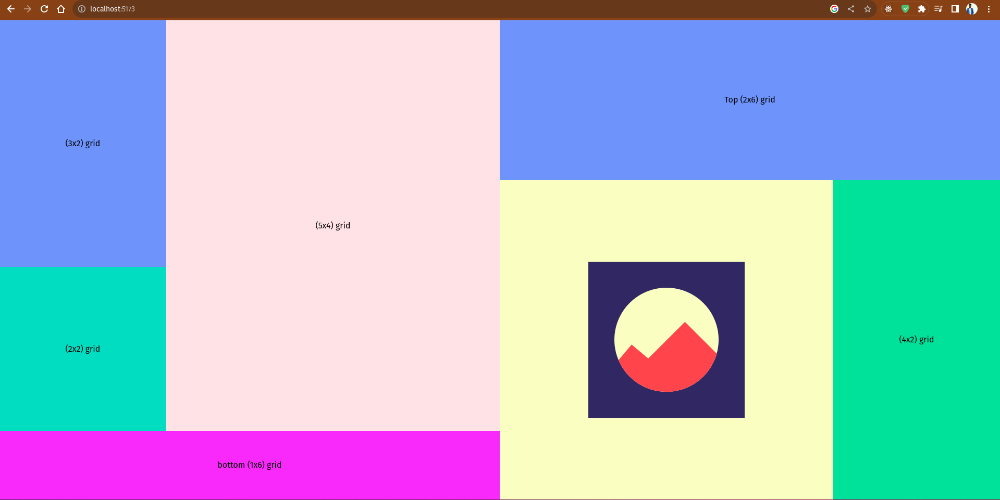
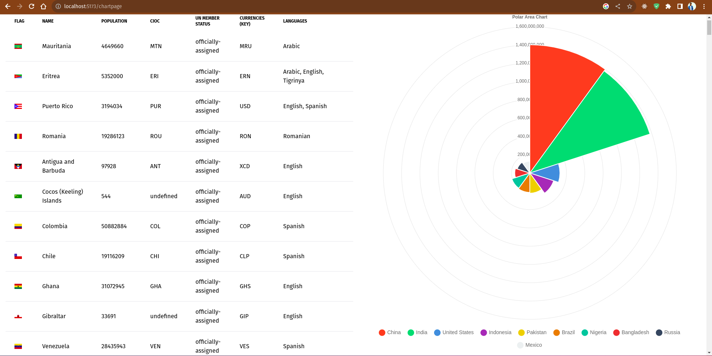
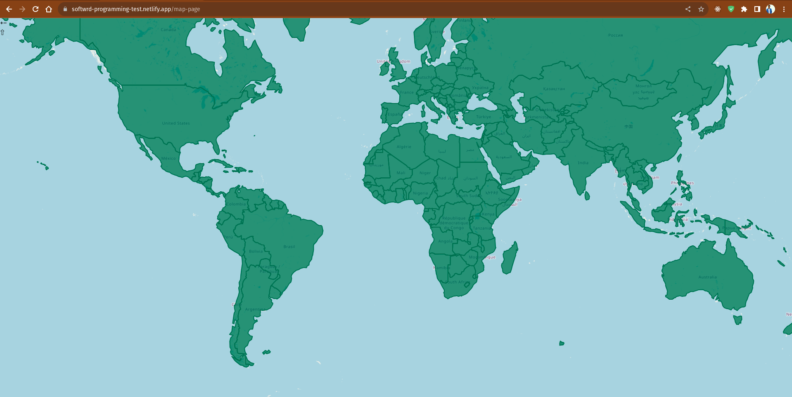

## Preliminary Assessment - Junior Frontend Engineer

This is my first time working with `Svelte`, and I'm excited to learn and build with it. Please be aware that my code may not strictly follow all best practices, and there is a possibility of mistakes as I'm still learning. I'm open to feedback and suggestions from you. So,if you see something that could be improved or if you have any tips, please feel free to share your thoughts.Your feedback is greatly appreciated.

### [Link to the problem](https://drive.google.com/file/d/1aFR2PzUDbYM47G25w9funyiSkUl0deXm/view?usp=sharing)

## Project Setup

- Clone this repository
- Run `npm install` [Make sure you have node installed on your machine]
- Then run `npm run dev` to start the project on localhost.

## Project Structure

```bash
.
├── figures
│   ├── chartpage.png
│   ├── layoutpage.png
│   └── mappage1.png
├── index.html
├── jsconfig.json
├── netlify.toml
├── package.json
├── package-lock.json
├── postcss.config.js
├── public
│   └── vite.svg
├── README.md
├── src
│   ├── app.css
│   ├── App.svelte
│   ├── assets
│   │   └── svelte.svg
│   ├── lib
│   │   ├── Counter.svelte
│   │   ├── CountryTable.svelte
│   │   └── PolarAreaChart.svelte
│   ├── main.js
│   ├── routes
│   │   ├── ChartPage.svelte
│   │   ├── Layout.svelte
│   │   └── MapPage.svelte
│   ├── stores
│   │   └── countryDataStore.js
│   └── vite-env.d.ts
├── svelte.config.js
├── tailwind.config.js
└── vite.config.js

```

## Routes

[Layout Page](https://softwrd-programming-test.netlify.app/) : `https://softwrd-programming-test.netlify.app/`

[Chart Page](https://softwrd-programming-test.netlify.app/chartpage) : `https://softwrd-programming-test.netlify.app/chartpage`

[Map Page](https://softwrd-programming-test.netlify.app/map-page) : `https://softwrd-programming-test.netlify.app/map-page`

## Layout Page



## Chart Page



## Map Page



## Issues

[Layout Page]

- Mobile view is not completly working as the problem given layout.

[Chart Page]

- Need to fix the styling issue to match the layout completely
- PolarAreaChart occasionally doesn't show up, it just gives some circles.

[Map Page]

- Due to some `cors` error, I couldn't use fetch to access this url (https://github.com/datasets/geo-countries/blob/master/data/countries.geojson)
- I've downloaded the data, but couldn't use the data for some weird issue.

  So, I have used [this url](https://openlayers.org/en/v4.6.5/examples/data/geojson/countries.geojson) and it works completely fine. I checked the data and it was same as the geojson data found after downloading from the [given link](https://github.com/datasets/geo-countries/blob/master/data/countries.geojson).
